# Canvas gauges für vis-2

Das Widget-Set hat vier Instrumente, die eine Zahl anzeigen: ein **lineares**, ein **radiales**, einen **Kompass**
und einen **flachen** Balken. Diese Seite beschreibt die **vis-2**-Version. vis (vis-1) hat dieselben Widgets mit
denselben Einstellungen; gezeichnet werden sie von derselben Bibliothek und sehen dort deshalb gleich aus.

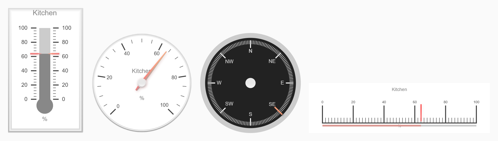

**Inhalt**

- [Allgemein](#allgemein)
    - [Voraussetzungen und Migration](#voraussetzungen-und-migration)
    - [Der Wert](#der-wert)
    - [Sektoren](#sektoren)
    - [Skalenstriche](#skalenstriche)
    - [Animation](#animation)
    - [Farben](#farben)
    - [Zeiger](#zeiger)
    - [Rahmen](#rahmen)
    - [Wert-Box](#wert-box)
    - [Schriften](#schriften)
- [Linear](#linear---tplcglineargauge)
- [Radial](#radial---tplcgradialgauge)
- [Kompass](#kompass---tplcgcompas)
- [Flach](#flach---tplcgflatgauge)
- [Unterschiede zu vis-1](#unterschiede-zu-vis-1)

## Allgemein

### Voraussetzungen und Migration

Die Widgets liegen im Widget-Set **Canvas-Zeigerinstrumente** in der Widget-Liste des vis-2-Editors. Die hier
beschriebenen React-Versionen benötigen **vis-2 2.12.8** oder neuer. Ältere vis-2-Versionen zeigen stattdessen die
vis-1-Widgets.

Mit vis-1 gebaute Projekte funktionieren ohne Änderung weiter. Beide Versionen verwenden dieselben Widget-IDs
(`tplCGlinearGauge`, `tplCGradialGauge`, `tplCGCompas`, `tplCGflatGauge`) und dieselben Attributnamen, und vis-2
wählt automatisch die React-Version. Alle Einstellungen werden übernommen.

In den Tabellen unten ist **Einstellung** die Beschriftung im vis-2-Editor und **Attribut** der Name, unter dem
der Wert im Projekt gespeichert wird. Der Attributname ist das, was man braucht, wenn man ein Projekt als JSON
bearbeitet oder Einstellungen von einem Widget zum anderen kopiert.

**Leer heißt "die Vorgabe der Bibliothek".** Fast jedes Feld ist optional. Solange es leer ist, nimmt das
Instrument die Vorgabe von [canvas-gauges](https://canvas-gauges.com) - dort ist auch die Bedeutung jeder Option
ausführlich dokumentiert. Nur die Einstellungen, die in den Tabellen eine Vorgabe haben, werden immer geschrieben.

Die Größe des Instruments ist die Größe des Widgets. Die Zeichnung wird bei jeder Größenänderung neu erzeugt, ein
Instrument kann also beliebig gestreckt werden - die runden sehen in einem quadratischen Kasten am besten aus.

### Der Wert

| Einstellung | Attribut | Vorgabe | Beschreibung |
|---|---|---|---|
| Objekt-ID | `oid` | | Der Datenpunkt, dessen Wert angezeigt wird. Beim Auswählen werden *Min*, *Max*, *Einheit* und *Titel* aus dem Objekt gefüllt, sofern sie noch leer sind. |
| Min | `minValue` | 0 | Anfang der Skala. |
| Max | `maxValue` | 100 | Ende der Skala. |
| Einheit | `units` | | Text unter dem Wert, z. B. `°C`. |
| Titel | `title` | | Text über der Mitte des Instruments. |
| Faktor | `factor` | 1 | Der Wert des Datenpunkts wird vor der Anzeige damit multipliziert. |
| Wertoffset | `valueOffset` | 0 | ... und danach wird dies addiert. Zusammen mit *Faktor* rechnet das eine Einheit um, z. B. `1.8` / `32` von °C nach °F. |

Solange der Datenpunkt keinen Wert hat, steht der Zeiger auf *Min*.

### Sektoren

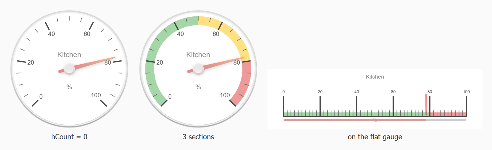

Abschnitte der Skala in einer eigenen Farbe, zum Beispiel grün bis 50, gelb bis 80 und darüber rot.

| Einstellung | Attribut | Vorgabe | Beschreibung |
|---|---|---|---|
| Anzahl von Sektoren | `hCount` | 1 | Wie viele Abschnitte es gibt. `0` schaltet sie ab. Jeder Abschnitt ergänzt einen Satz der drei Felder darunter. |
| Von | `highlightsFrom1`, `highlightsFrom2`, ... | | Anfang des Abschnitts, in den Werten der Skala. Ein Abschnitt mit leerem *Von* wird übersprungen. |
| Bis | `highlightsTo1`, ... | | Ende des Abschnitts. |
| Farbe | `highlightsColor1`, ... | | Farbe des Abschnitts. |

### Skalenstriche

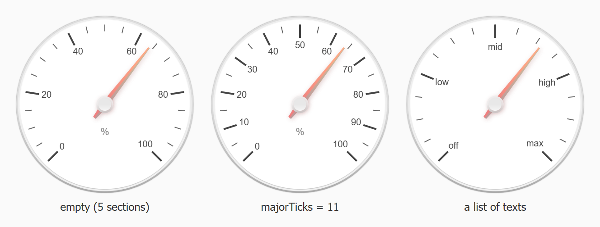

| Einstellung | Attribut | Vorgabe | Beschreibung |
|---|---|---|---|
| Hauptstriche | `majorTicks` | | Die beschrifteten Striche. Leer teilt die Skala in fünf Abschnitte. Eine Zahl, z. B. `11`, ergibt so viele Beschriftungen gleichmäßig zwischen *Min* und *Max*. Eine durch Kommas getrennte Liste, z. B. `aus,niedrig,mittel,hoch,max`, wird als Beschriftung selbst verwendet - so bekommt der Kompass seine Himmelsrichtungen. |
| Zwischenstriche | `minorTicks` | je Widget | Anzahl der unbeschrifteten Striche zwischen zwei Hauptstrichen. |
| Striche umranden | `strokeTicks` | je Widget | Zeichnet eine Linie entlang der Skala, die die Striche verbindet. |
| Vor Komma | `majorTicksInt` | 4 | Stellen vor dem Komma der Beschriftungen; kürzere Zahlen bekommen führende Nullen. |
| Nach Komma | `majorTicksDec` | 2 | Stellen nach dem Komma der Beschriftungen. |

### Animation

| Einstellung | Attribut | Vorgabe | Beschreibung |
|---|---|---|---|
| Aktiviert | `animation` | ein | Der Zeiger fährt zum neuen Wert, statt zu springen. |
| Dauer | `animationDuration` | 500 | Dauer der Fahrt in ms. |
| Verlauf | `animationRule` | `linear` | Verlauf der Fahrt: `linear`, `quad`, `quint`, `cycle`, `bounce`, `elastic` und ihre `de...`-Gegenstücke, die andersherum laufen. |
| Wert animieren | `animatedValue` | aus | Die Zahl in der Wert-Box zählt mit dem Zeiger mit. |
| Beim Start animieren | `animateOnInit` | aus | Der Zeiger startet beim Öffnen der Ansicht auf *Min* und fährt zum aktuellen Wert. |
| Animationsziel | `animationTarget` | `needle` | Nur radial und Kompass: `Zeiger` dreht den Zeiger, `Scheibe` dreht die Scheibe unter einem festen Zeiger - so, wie ein echter Kompass arbeitet. |

### Farben

Jeder Teil eines Instruments hat seine eigene Farbe, und ein leeres Feld behält die Farbe der Bibliothek. Eine
Einstellung mit *Ende* im Namen ist die zweite Farbe eines Verlaufs.

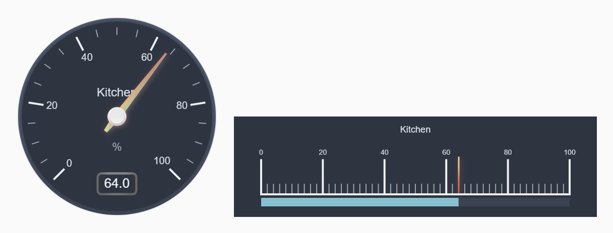

| Einstellung | Attribut | Beschreibung |
|---|---|---|
| Scheibe / Scheibe Ende | `colorPlate`, `colorPlateEnd` | Das Zifferblatt. |
| Hauptstriche / Zwischenstriche | `colorMajorTicks`, `colorMinorTicks` | Die Striche der Skala. |
| Titel / Einheit / Zahlen | `colorTitle`, `colorUnits`, `colorNumbers` | Die drei Texte auf der Scheibe. |
| Zeiger / Zeiger Ende | `colorNeedle`, `colorNeedleEnd` | Der Zeiger, von der Achse bis zur Spitze. |
| Zeigerschatten oben / unten | `colorNeedleShadowUp`, `colorNeedleShadowDown` | Der Schatten, den der Zeiger auf die Scheibe wirft. |
| Werttext / Schatten des Werttextes | `colorValueText`, `colorValueTextShadow` | Die Zahl in der Wert-Box. |
| Rahmen außen / Mitte / innen (+ *Ende*) | `colorBorderOuter`, `colorBorderMiddle`, `colorBorderInner`, ... | Die drei Ringe um die Scheibe. |
| Rahmenschatten | `colorBorderShadow` | Der Schatten unter dem äußeren Ring. |
| Wert-Box Rahmen / Hintergrund / Schatten (+ *Ende*) | `colorValueBoxRect`, `colorValueBoxBackground`, `colorValueBoxShadow`, ... | Der Kasten um den Wert. |

Radial und Kompass haben zusätzlich die Farben des Kreises in der Mitte: `colorNeedleCircleOuter`,
`colorNeedleCircleOuterEnd`, `colorNeedleCircleInner` und `colorNeedleCircleInnerEnd`.

Linear und flach haben zusätzlich die Farben des Balkens: `colorBarStroke`, `colorBar`, `colorBarEnd`,
`colorBarProgress` und `colorBarProgressEnd`.

### Zeiger

| Einstellung | Attribut | Beschreibung |
|---|---|---|
| Zeiger anzeigen | `needle` | Aus zeichnet ein Instrument ohne Zeiger - nützlich, wenn nur der Balken oder die Wert-Box zu sehen sein soll. |
| Schatten | `needleShadow` | Der Zeiger wirft einen Schatten auf die Scheibe. |
| Typ | `needleType` | `Pfeil` ist der spitz zulaufende Zeiger, `Linie` eine gerade Linie von *Breite* Pixeln. |
| Anfang / Ende | `needleStart`, `needleEnd` | Wo der Zeiger beginnt und endet, in Prozent des Radius (beim linearen Instrument der Länge). `0` ist die Mitte. |
| Breite | `needleWidth` | Breite des Zeigers an der Achse. |

### Rahmen

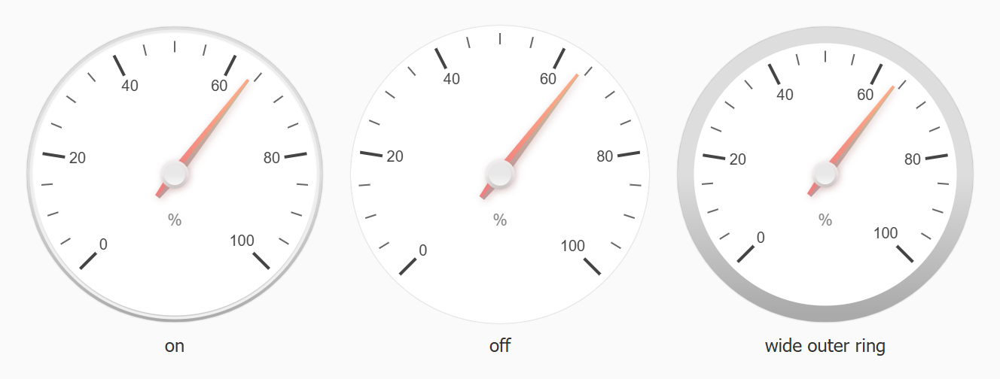

Drei Ringe und ein Schatten umgeben die Scheibe. Eine Breite von `0` blendet den jeweiligen Ring aus.

| Einstellung | Attribut | Beschreibung |
|---|---|---|
| Aktiviert | `borders` | Aus entfernt alle Ringe auf einmal. |
| Breite außen / Mitte / innen | `borderOuterWidth`, `borderMiddleWidth`, `borderInnerWidth` | Breite der drei Ringe. |
| Breite des Schattens | `borderShadowWidth` | Breite des Schattens unter dem äußeren Ring. |

### Wert-Box

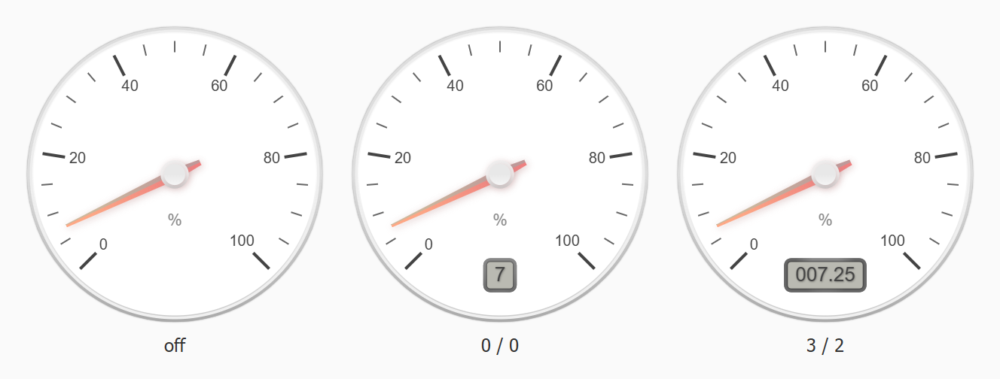

Der Kasten unter der Mitte, der den Wert als Zahl zeigt.

| Einstellung | Attribut | Vorgabe | Beschreibung |
|---|---|---|---|
| Aktiviert | `valueBox` | aus | Zeigt den Kasten. |
| Linienbreite | `valueBoxStroke` | | Breite des Rahmens um den Kasten. |
| Text | `valueText` | | Fester Text statt des Wertes. Er wird nur angezeigt, solange die *Objekt-ID* keinen Wert hat, sonst gewinnt der Wert. |
| Textschatten | `valueTextShadow` | | Die Zahl wirft einen Schatten. |
| Eckenradius | `valueBoxBorderRadius` | | Rundung der Ecken des Kastens. |
| Vor Komma | `valueInt` | 0 | Stellen vor dem Komma. Eine kürzere Zahl bekommt führende Nullen, z. B. `007.25` bei 3 / 2. |
| Nach Komma | `valueDec` | 0 | Stellen nach dem Komma. `0` rundet auf eine ganze Zahl. |

### Schriften

Familie, Größe, Stil und Stärke der vier Texte - *Zahlen* (die Skala), *Titel*, *Einheit* und *Wert*.

| Einstellung | Attribut | Beschreibung |
|---|---|---|
| Zahlen / Titel / Einheit / Wert | `fontNumbers`, `fontTitle`, `fontUnits`, `fontValue` | Die Schriftfamilie. |
| Größe ... | `fontNumbersSize`, `fontTitleSize`, `fontUnitsSize`, `fontValueSize` | Die Größe. Sie wird mit dem Instrument skaliert, ist also eine relative Zahl und keine px-Angabe. |
| Stil ... | `fontNumbersStyle`, ... | `normal`, `italic` oder `oblique`. |
| Stärke ... | `fontNumbersWeight`, ... | `normal`, `bold`, `bolder`, `lighter` oder eine Zahl wie `600`. |

## Linear - `tplCGlinearGauge`

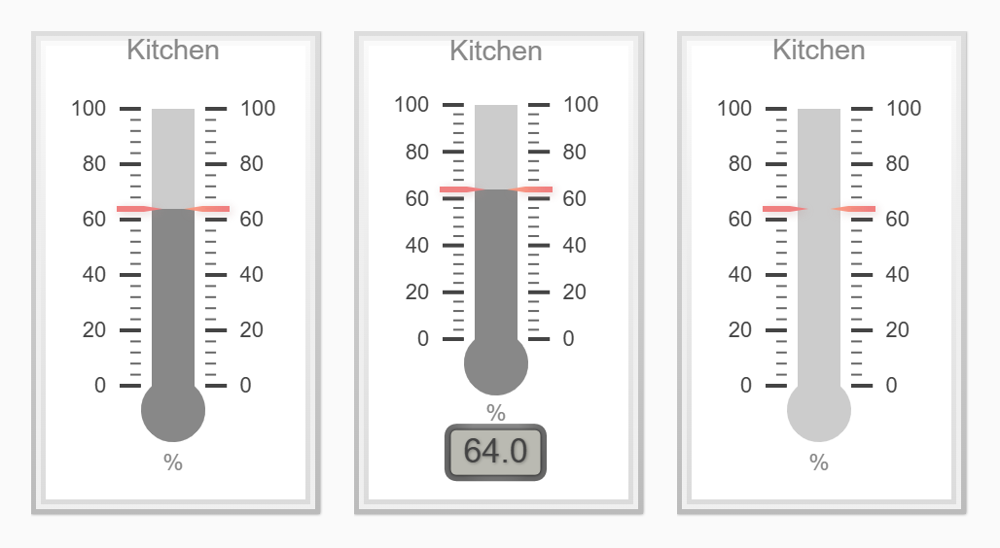

Das stehende Instrument: eine Scheibe mit Rahmen, die Skala auf beiden Seiten und ein Balken, der bis zum Wert
gefüllt wird. Die Vorgabegröße ist 150 x 250 mit 10 px Eckenradius - die Scheibe übernimmt diesen Radius, das
Instrument behält also die Form des Widgets.

Zusätzlich zu den Einstellungen oben gibt es den Balken:

| Einstellung | Attribut | Vorgabe | Beschreibung |
|---|---|---|---|
| Kreis am Anfang | `barBeginCircle` | | Durchmesser des runden Endes unten am Balken, in Prozent der Balkenbreite. `0` ergibt einen geraden Balken; das ist die Kugel des Thermometers. |
| Breite | `barWidth` | | Breite des Balkens in Prozent der Scheibe. |
| Länge | `barLength` | | Länge des Balkens in Prozent der Scheibe. |
| Linienbreite | `barStrokeWidth` | | Breite der Linie um den Balken. |
| Fortschritt | `barProgress` | ein | Füllt den Balken bis zum Wert. Aus bleibt der Balken leer und nur der Zeiger bewegt sich. |

und die Lage der Skala:

| Einstellung | Attribut | Vorgabe | Beschreibung |
|---|---|---|---|
| Seite der Striche | `tickSide` | `beide` | Auf welcher Seite des Balkens die Striche liegen: `beide`, `links` oder `rechts`. |
| Seite des Zeigers | `needleSide` | `beide` | Dasselbe für den Zeiger. |
| Seite der Zahlen | `numberSide` | `beide` | Dasselbe für die Beschriftungen. |
| Breite | `ticksWidth` | | Länge der Hauptstriche, in Prozent. |
| Breite der Zwischenstriche | `ticksWidthMinor` | | Länge der Zwischenstriche. |
| Abstand | `ticksPadding` | | Abstand zwischen den Strichen und dem Balken. |

Vorgaben dieses Widgets: *Zwischenstriche* 5, *Rahmen* ein, *Fortschritt* ein.

## Radial - `tplCGradialGauge`

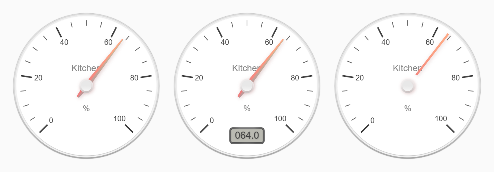

Das runde Instrument: eine Skala über 270 Grad, die unten links beginnt, drei Ringe um die Scheibe und ein
Pfeilzeiger. Die Vorgabegröße ist 200 x 200.

| Einstellung | Attribut | Vorgabe | Beschreibung |
|---|---|---|---|
| Winkel der Skala | `ticksAngle` | 270 | Wie weit die Skala um die Scheibe läuft, in Grad. `360` ist der volle Kreis. |
| Startwinkel | `startAngle` | 45 | Wo die Skala beginnt, in Grad von unten. |
| Kreisgröße | `needleCircleSize` | | Größe des Kreises in der Mitte, um den sich der Zeiger dreht, in Prozent. |
| Kreis innen | `needleCircleInner` | | Zeichnet den inneren Kreis. |
| Kreis außen | `needleCircleOuter` | | Zeichnet den äußeren Kreis. |

Vorgaben dieses Widgets: *Zwischenstriche* 4, *Zeiger anzeigen* ein, *Schatten* ein, *Typ* `Pfeil`, *Rahmen* ein
mit allen vier Breiten auf 2.

## Kompass - `tplCGCompas`

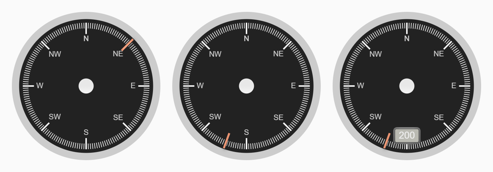

Ein radiales Instrument über den vollen Kreis, als Kompassrose voreingestellt: die Skala läuft von 0 bis 360, die
Hauptstriche sind `N,NE,E,SE,S,SW,W,NW,N`, dazwischen liegen 22 Zwischenstriche, und der Zeiger ist eine dünne
Linie auf einer dunklen Scheibe.

Er hat genau die Einstellungen des [radialen](#radial---tplcgradialgauge) Instruments, nur mit anderen Vorgaben:

| Einstellung | Attribut | Vorgabe |
|---|---|---|
| Min / Max | `minValue` / `maxValue` | 0 / 360 |
| Hauptstriche | `majorTicks` | `N,NE,E,SE,S,SW,W,NW,N` |
| Zwischenstriche / Striche umranden | `minorTicks` / `strokeTicks` | 22 / aus |
| Dauer | `animationDuration` | 1000 |
| Scheibe | `colorPlate` | `#222` |
| Hauptstriche / Zwischenstriche / Zahlen | `colorMajorTicks` / `colorMinorTicks` / `colorNumbers` | `#f5f5f5` / `#ddd` / `#ccc` |
| Zeiger / Zeiger Ende | `colorNeedle` / `colorNeedleEnd` | `rgba(240,128,128,1)` / `rgba(255,160,122,.9)` |
| Rahmen außen (+ Ende) | `colorBorderOuter`, `colorBorderOuterEnd` | `#ccc` |
| Zeigerschatten unten | `colorNeedleShadowDown` | `#222` |
| Typ / Anfang / Ende / Breite | `needleType` / `needleStart` / `needleEnd` / `needleWidth` | `Linie` / 75 / 99 / 3 |
| Breite außen | `borderOuterWidth` | 10, die anderen drei 0 |
| Winkel der Skala / Startwinkel | `ticksAngle` / `startAngle` | 360 / 180 |
| Zeigerkreis außen | `colorNeedleCircleOuter` | `#ccc` |
| Kreisgröße / Kreis außen | `needleCircleSize` / `needleCircleOuter` | 15 / aus |

Für eine Windrichtung, die sich wie ein echter Kompass dreht, *Animationsziel* auf `Scheibe` stellen: dann steht
der Zeiger still und die Rose dreht sich darunter.

## Flach - `tplCGflatGauge`

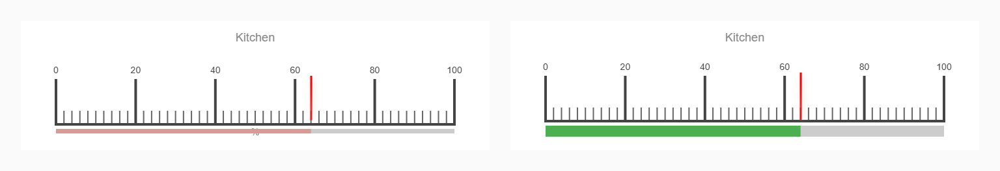

Ein liegendes lineares Instrument ohne jeden Rahmen: eine weiße Scheibe, die Skala und der Zeiger über einem
schmalen farbigen Balken. Die Vorgabegröße ist 360 x 100.

Es hat die Einstellungen des [linearen](#linear---tplcglineargauge) Instruments mit anderen Vorgaben:

| Einstellung | Attribut | Vorgabe |
|---|---|---|
| Zwischenstriche / Striche umranden | `minorTicks` / `strokeTicks` | 10 / ein |
| Scheibe | `colorPlate` | `#fff` |
| Zeiger / Zeiger Ende | `colorNeedle` / `colorNeedleEnd` | `red` / `rgba(255,0,0,0.7)` |
| Typ / Breite | `needleType` / `needleWidth` | `Linie` / 3 |
| Rahmen | `borders` | aus, alle vier Breiten 0 |
| Kreis am Anfang / Breite | `barBeginCircle` / `barWidth` | 0 / 5 |
| Fortschritt | `colorBarProgress` | `#db9994` |
| Seite der Striche / des Zeigers / der Zahlen | `tickSide` / `needleSide` / `numberSide` | `links` |
| Breite / Breite der Zwischenstriche | `ticksWidth` / `ticksWidthMinor` | 50 / 15 |

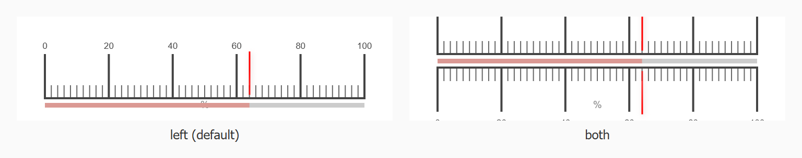

Stellt man die drei Seiten auf `beide`, liegt die Skala über und unter dem Balken.

## Unterschiede zu vis-1

Die React-Widgets zeichnen dieselben Instrumente mit derselben Bibliothek, ein migriertes Projekt sieht also
gleich aus. Ein paar Dinge wurden dabei repariert:

- ***Abstand* der Balkenstriche wirkt.** Das vis-1-Widget schrieb *Abstand* in *Kreis am Anfang*, die Einstellung
  verschob also das runde Ende des Balkens statt des Abstands der Striche.
- ***Stärke des Wertes* wirkt.** Das vis-1-Widget schrieb *Stärke des Wertes* in die Schriftfamilie der Zahlen und
  ersetzte damit die Schrift der Skala durch das Wort `bold`.
- **Die Skala behält ihre letzte Beschriftung.** Ist *Hauptstriche* eine Zahl, werden die Beschriftungen aus der
  Anzahl der Abschnitte berechnet. Das vis-1-Widget addierte die Schrittweite wiederholt auf und ließ die letzte
  Beschriftung weg, sobald die Summe das Maximum um einen Rundungsfehler überschritt - z. B. bei einem Bereich von
  0 bis 0,3 mit 4 Beschriftungen.
- **Ein beim Öffnen leerer Datenpunkt kommt trotzdem an.** Das vis-1-Widget abonnierte den Datenpunkt nur, wenn er
  schon einen Wert hatte; ein Instrument an einem frisch gestarteten Adapter blieb daher auf seinem Minimum
  stehen, bis die Ansicht neu geladen wurde.
- **Der Zeigertyp des radialen Instruments ist `Pfeil`.** Seine vis-1-Vorgabe war das Wort `select`, der Name des
  Feldtyps, der in die Vorgabe gerutscht war. Die Bibliothek zeichnete dafür ohnehin einen Pfeil, auf der Ansicht
  ändert sich also nichts.
- *Hauptstriche* ist jetzt in allen Widgets ein Textfeld. In vis-1 war es außer beim Kompass ein Schieberegler,
  eine Liste von Beschriftungen ließ sich also nur dort eingeben.
- *Zwischenstriche* geht bis 50 statt bis 20 - der Kompass hat als Vorgabe 22, was sein eigener Schieberegler
  nicht erreichen konnte.
